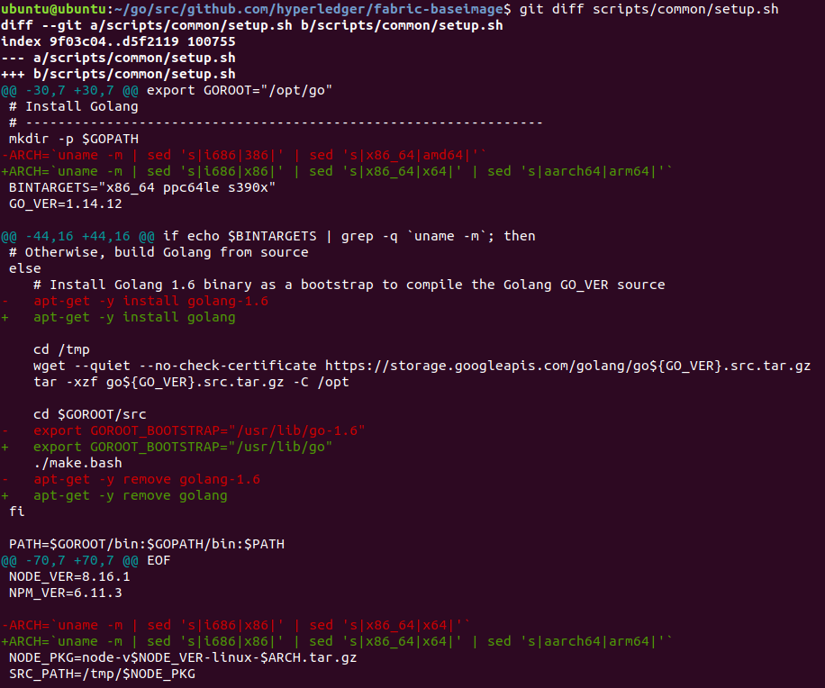
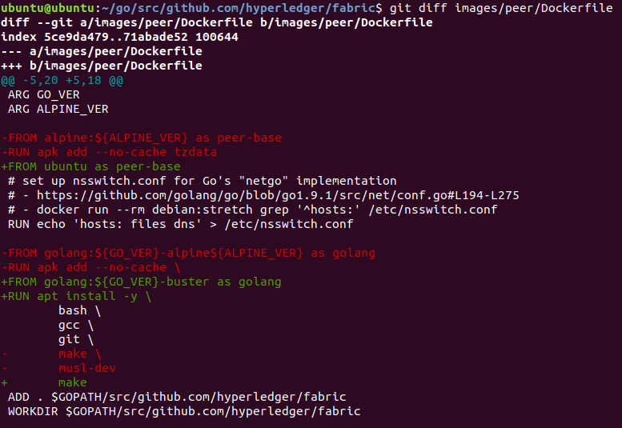
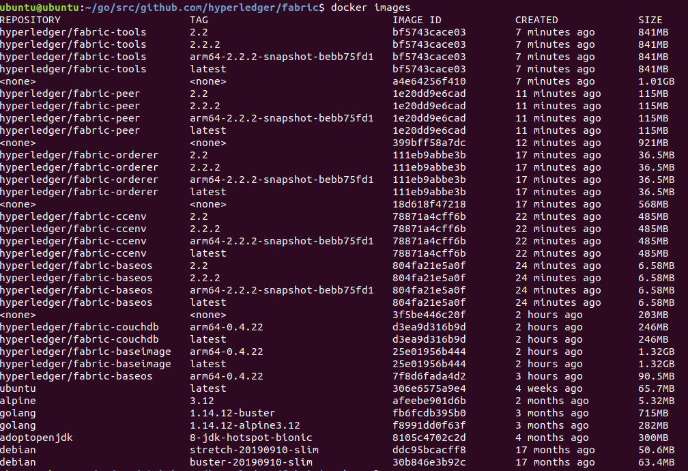

# 樹莓派上執行fabric2.2.2

* 源自 [busan15/fabric-binaries-pi](https://github.com/busan15/fabric-binaries-pi)
* 參考 [將1.4.X區塊鏈應用升級成2.X.X時，發生安裝合約失敗](http://192.168.101.252/blockchain/fabric-troubleshoot/-/tree/master/Upgrade%20error)，使1.4.X版本的應用可以直接在2.2.2使用

## 預先環境安裝

* see fabric1.4.1 folder
---

## 下載專案


```sh
cd ~/go/src/github.com/hyperledger

git clone https://github.com/hyperledger/fabric.git
git clone https://github.com/hyperledger/fabric-samples.git
git clone https://github.com/hyperledger/fabric-baseimage.git
git clone https://github.com/hyperledger/fabric-ca.git

cd ~/go/src/github.com/hyperledger/fabric
git checkout v2.2.2

cd ~/go/src/github.com/hyperledger/fabric-samples
git checkout v2.2.2

cd ~/go/src/github.com/hyperledger/fabric-baseimage
git checkout v0.4.22

cd ~/go/src/github.com/hyperledger/fabric-ca
```

---

## fabric-baseimage

### 進入baseimage專案
```sh
cd ~/go/src/github.com/hyperledger/fabric-baseimage
```

### 修改Dockerfile
```sh
vim config/baseimage/Dockerfile
```

```
刪除 FROM adoptopenjdk:8u222-b10-jdk-openj9-0.15.1
調整為 FROM adoptopenjdk:8-jdk-hotspot-bionic
```


### 修改script
```sh
vim scripts/common/setup.sh
```

```
apt-get -y install golang-1.6
調整為
apt-get -y install golang
```

```
export GOROOT_BOOTSTRAP="/usr/lib/go-1.6"
調整為
export GOROOT_BOOTSTRAP="/usr/lib/go"
```

```
apt-get -y remove golang-1.6
調整為
apt-get -y remove golang
```

```
ARCH=`uname -m | sed 's|i686|x86|' | sed 's|x86_64|x64|'`
調整為
ARCH=`uname -m | sed 's|i686|x86|' | sed 's|x86_64|x64|' | sed 's|aarch64|arm64|'`
```


### 編譯docker鏡像

```sh
cd ~/go/src/github.com/hyperledger/fabric-baseimage/
make
```


---

## fabric

### 進入fabric專案
```sh
cd ~/go/src/github.com/hyperledger/fabric
```

### 修改ccenv Dockerfile
```sh
vim images/ccenv/Dockerfile
```

```
在RUN apk add指令中
增加
binutils-gold \
```


### 修改orderer Dockerfile
```sh
vim images/orderer/Dockerfile
```

```
在RUN apk add指令中
增加
binutils-gold \
```


### 修改peer Dockerfile
```sh
vim images/peer/Dockerfile
```

```
刪除 FROM alpine:${ALPINE_VER} as peer-base
刪除 RUN apk add --no-cache tzdata
調整為 FROM ubuntu as peer-base
```

```
刪除 FROM golang:${GO_VER}-alpine${ALPINE_VER} as golang
調整為 FROM golang:${GO_VER}-buster as golang

刪除 RUN apk add --no-cache \
調整為 RUN apt install -y \

增加 binutils \

刪除 musl-dev

make \ 調整為 make
```


### 修改tools Dockerfile
```sh
vim images/tools/Dockerfile
```

```
刪除 FROM golang:${GO_VER}-alpine${ALPINE_VER} as golang
調整為 FROM golang:${GO_VER}-buster as golang

刪除 RUN apk add --no-cache \
調整為 RUN apt install -y \

刪除 musl-dev

make \ 調整為 make;

刪除 FROM golang:${GO_VER}-alpine
調整為 FROM golang:${GO_VER}-buster

刪除 RUN apk add --no-cache \
調整為 RUN apt install -y \

刪除 jq \
刪除 tzdata;

git \ 調整為 git;

```


### 修改core.yaml
```sh
vim sampleconfig/core.yaml
```

```
註解bootstrap: 127.0.0.1:7051

Memory: 2147483648 改成 Memory: 16777216
```


### 編譯docker鏡像及binary檔
```sh
cd ~/go/src/github.com/hyperledger/fabric
make
```


### 移動binary檔
```sh
cd ~/go/src/github.com/hyperledger/fabric/build/bin

sudo cp * /usr/local/bin/

ll /usr/local/bin/
```

---

## fabric-ca

### 進入fabric專案
```sh
cd ~/go/src/github.com/hyperledger/fabric-ca
```

### 修改Dockerfile
```sh
vim images/fabric-ca/Dockerfile
```

```
刪除 FROM golang:${GO_VER}-alpine as builder
調整為 FROM golang:${GO_VER}-buster as builder

刪除 RUN apk add --no-cache \
調整為 RUN apt install -y \

刪除 musl-dev

git \ 調整為 git;

刪除 FROM alpine:${ALPINE_VER}
刪除 RUN apk add --no-cache \
刪除 tzdata;
調整為 FROM ubuntu:19.10
```


### 編譯docker鏡像

```sh
cd ~/go/src/github.com/hyperledger/fabric-ca/
make
```
