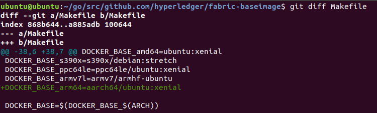
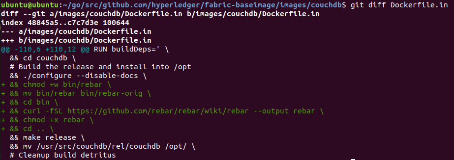
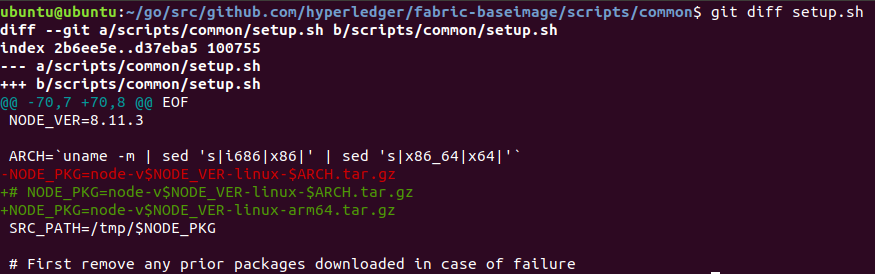
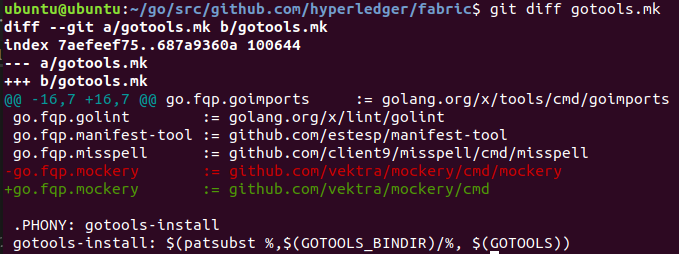
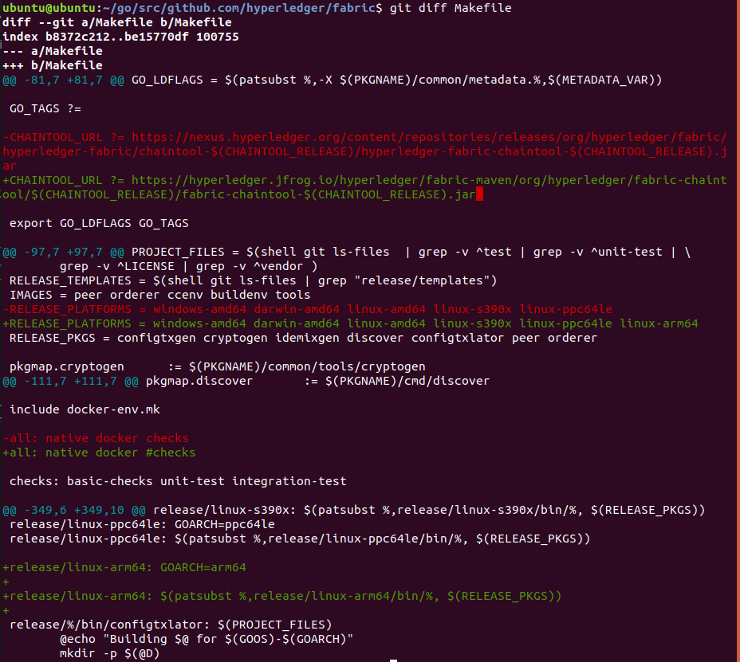
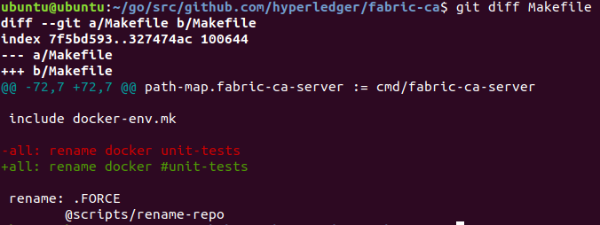

# 樹莓派上執行fabric1.4.1

* aarch64和arm64指的是同一件事
* [Hyperledger fabric 1.4 + 樹莓派 環境搭建](https://www.twblogs.net/a/5d4044aabd9eee51fbf985ca)
* [Index of fabric-maven/org/hyperledger/fabric-chaintool/1.1.3](https://hyperledger.jfrog.io/hyperledger/fabric-maven/org/hyperledger/fabric-chaintool/1.1.3/)
* [Error in building the Hyperledger Fabric v1.4.4 source code](https://stackoverflow.com/questions/63258831/error-in-building-the-hyperledger-fabric-v1-4-4-source-code)

## 預先環境安裝

### 安裝 cmd
```sh
sudo apt-get install curl jq git
```

### 安裝 go
```sh
uname -a

gozip="go1.15.linux-arm64.tar.gz"
curl -O https://storage.googleapis.com/golang/${gozip}
sudo tar -C /usr/local -xzf ./${gozip}

file="/home/${USER}/.bashrc"
echo "" >> ${file}
echo "#GO VARIABLES" >> ${file}
echo "export GOROOT=/usr/local/go" >> ${file}
echo "export GOPATH=~/go" >> ${file}
echo 'export PATH=$PATH:$GOROOT/bin' >> ${file}
echo 'export PATH=$PATH:$GOPATH/bin' >> ${file}
echo "#END GO VARIABLES" >> ${file}
source ~/.bashrc
go version

mkdir ~/go && mkdir -p ~/go/src ~/go/pkg ~/go/bin

mkdir -p ~/go/src/github.com/hyperledger
```

### 安裝 docker
```sh
curl -sSL https://get.docker.com/ | sh
sudo usermod -aG docker ${USER}

docker version
```

### 安裝 docker-compose
```sh
sudo apt-get update
sudo apt-get upgrade

sudo apt-get install -y python
sudo apt install python3-pip

sudo apt-get install libffi-dev

sudo apt  install docker-compose

docker-compose version
```

### 重開機 (為了docker使用)
```sh
sudo reboot now

docker ps -a
```

### 安裝protobuf (編譯鏡像時使用)
```sh
sudo apt-get install protobuf-compiler

cd ~/go/src/github.com
go get -u github.com/golang/protobuf/protoc-gen-go
```

---

## 下載專案


```sh
cd ~/go/src/github.com/hyperledger

git clone https://github.com/hyperledger/fabric.git
cd ~/go/src/github.com/hyperledger/fabric
git checkout v1.4.1

git clone https://github.com/hyperledger/fabric-samples.git
cd ~/go/src/github.com/hyperledger/fabric-samples
git checkout v1.4.1

git clone https://github.com/hyperledger/fabric-baseimage.git
cd ~/go/src/github.com/hyperledger/fabric-baseimage
git checkout v0.4.15

git clone https://github.com/hyperledger/fabric-ca.git
cd ~/go/src/github.com/hyperledger/fabric-ca
git checkout v1.4.1
```

---

## fabric-baseimage

### 進入baseimage專案
```sh
cd ~/go/src/github.com/hyperledger/fabric-baseimage
```

### 修改Makeflie文件
```sh
vim Makefile
```

```
在第41行增加

DOCKER_BASE_arm64=aarch64/ubuntu:xenial
```


### 修改dockerfile
```sh
cd ~/go/src/github.com/hyperledger/fabric-baseimage/images/couchdb

vim Dockerfile.in
```

```
在第112行增加

&& chmod +w bin/rebar \
&& mv bin/rebar bin/rebar-orig \
&& cd bin \
&& curl -fSL https://github.com/rebar/rebar/wiki/rebar --output rebar \
&& chmod +x rebar \
&& cd .. \
```


### 修改script
```sh
cd ~/go/src/github.com/hyperledger/fabric-baseimage/scripts/common

vim setup.sh
```

```
在第73行增加

NODE_PKG=node-v$NODE_VER-linux-$ARCH.tar.gz
```


### 編譯docker鏡像
```sh
cd ~/go/src/github.com/hyperledger/fabric-baseimage/
make
```

```
REPOSITORY                     TAG                              IMAGE ID            CREATED             SIZE
hyperledger/fabric-zookeeper   arm64-0.4.15                     c74a622022e5        25 hours ago        1.56GB
hyperledger/fabric-zookeeper   latest                           c74a622022e5        25 hours ago        1.56GB
hyperledger/fabric-kafka       arm64-0.4.15                     7c173e3613f1        25 hours ago        1.57GB
hyperledger/fabric-kafka       latest                           7c173e3613f1        25 hours ago        1.57GB
hyperledger/fabric-couchdb     arm64-0.4.15                     2774d744ccb7        25 hours ago        1.62GB
hyperledger/fabric-couchdb     latest                           2774d744ccb7        25 hours ago        1.62GB
hyperledger/fabric-baseimage   arm64-0.4.15                     60243b3c3e57        26 hours ago        1.51GB
hyperledger/fabric-baseimage   latest                           60243b3c3e57        26 hours ago        1.51GB
hyperledger/fabric-basejvm     arm64-0.4.15                     6b449aeae969        27 hours ago        499MB
hyperledger/fabric-basejvm     latest                           6b449aeae969        27 hours ago        499MB
hyperledger/fabric-baseos      arm64-0.4.15                     d3ffb06c00d7        27 hours ago        190MB
hyperledger/fabric-baseos      latest                           d3ffb06c00d7        27 hours ago        190MB
aarch64/ubuntu                 xenial                           a7d1ddc47ced        3 years ago         110MB
```

---

## fabric

### 進入fabric專案
```sh
cd ~/go/src/github.com/hyperledger/fabric
```

### 修改Makeflie文件
```sh
vim gotools.mk
```

```
更改mockery路徑

github.com/vektra/mockery/cmd
```


### 修改Makeflie文件
```sh
vim Makefile
```

```
修改第84行

CHAINTOOL_URL ?= https://hyperledger.jfrog.io/hyperledger/fabric-maven/org/hyperledger/fabric-chaintool/$(CHAINTOOL_RELEASE)/fabric-chaintool-$(CHAINTOOL_RELEASE).jar
```

```
註解第114行的checks

#checks
```

```
在第100行增加

linux-arm64
```

```
在第350行後增加

release/linux-arm64: GOARCH=arm64

release/linux-arm64: $(patsubst %,release/linux-arm64/bin/%, $(RELEASE_PKGS))
```


### 編譯docker鏡像
```sh
cd ~/go/src/github.com/hyperledger/fabric
make
```

```
REPOSITORY                     TAG                              IMAGE ID            CREATED             SIZE
hyperledger/fabric-ca          arm64-1.4.1                      71ff8179ded3        6 hours ago         310MB
hyperledger/fabric-ca          latest                           71ff8179ded3        6 hours ago         310MB
hyperledger/fabric-tools       arm64-1.4.1-snapshot-87074a73f   c1edf65fe837        6 hours ago         1.68GB
hyperledger/fabric-tools       arm64-latest                     c1edf65fe837        6 hours ago         1.68GB
hyperledger/fabric-tools       latest                           c1edf65fe837        6 hours ago         1.68GB
hyperledger/fabric-buildenv    arm64-1.4.1-snapshot-87074a73f   903012823757        6 hours ago         1.59GB
hyperledger/fabric-buildenv    arm64-latest                     903012823757        6 hours ago         1.59GB
hyperledger/fabric-buildenv    latest                           903012823757        6 hours ago         1.59GB
hyperledger/fabric-ccenv       arm64-1.4.1-snapshot-87074a73f   2c17365158a9        6 hours ago         1.55GB
hyperledger/fabric-ccenv       arm64-latest                     2c17365158a9        6 hours ago         1.55GB
hyperledger/fabric-ccenv       latest                           2c17365158a9        6 hours ago         1.55GB
hyperledger/fabric-orderer     arm64-1.4.1-snapshot-87074a73f   d11bc33c4a67        6 hours ago         218MB
hyperledger/fabric-orderer     arm64-latest                     d11bc33c4a67        6 hours ago         218MB
hyperledger/fabric-orderer     latest                           d11bc33c4a67        6 hours ago         218MB
hyperledger/fabric-peer        arm64-1.4.1-snapshot-87074a73f   5a2bcfe39bd2        6 hours ago         223MB
hyperledger/fabric-peer        arm64-latest                     5a2bcfe39bd2        6 hours ago         223MB
hyperledger/fabric-peer        latest                           5a2bcfe39bd2        6 hours ago         223MB
```

### 編譯docker鏡像
```sh
cd ~/go/src/github.com/hyperledger/fabric
make release
```

```
成功之後會在release/linux-arm64/bin目錄下生成二進制文件
```

---

## fabric-ca

### 進入fabric-ca專案
```sh
cd ~/go/src/github.com/hyperledger/fabric-ca
```

### 修改Makeflie文件
```sh
vim Makefile
```

```
註解第72行的checks

#unit-tests
```




### 編譯docker鏡像
```sh
cd ~/go/src/github.com/hyperledger/fabric-ca
make
```

```
REPOSITORY                     TAG                              IMAGE ID            CREATED             SIZE
hyperledger/fabric-ca          arm64-1.4.1                      71ff8179ded3        6 hours ago         310MB
hyperledger/fabric-ca          latest                           71ff8179ded3        6 hours ago         310MB
```

---

### fabric-samples

### 使用fabric-samples/first-network測試
```sh
cd ~/go/src/github.com/hyperledger/fabric-samples/first-network

./byfn.sh up
```


