# 在pi上編譯v2.2.4
## 相關連結
* https://wiki.alpinelinux.org/wiki/Release_Notes_for_Alpine_3.14.0#faccessat2
* https://gitlab.alpinelinux.org/alpine/aports/-/issues/12396
---

## 環境版本
```sh
go version go1.17.3 linux/arm64
Docker version 20.10.7, build f0df350
docker-compose version 1.29.0, build unknown
```

---

## 安裝環境
### docker
* 根據https://docs.docker.com/engine/install/ubuntu/ 安裝
* 安裝特定版本：5:20.10.7~3-0~ubuntu-bionic
```sh
sudo apt-get install docker-ce=5:20.10.7~3-0~ubuntu-bionic docker-ce-cli=5:20.10.7~3-0~ubuntu-bionic containerd.io

sudo usermod -aG docker ${USER}
```

---

## 注意事項
* go 1.16.7以上才可編譯
* alpine使用3.14，須安裝docker 20.10以上才可編譯
* 不同設備運行的節點，必須相同版本才可溝通
* 截至2021/11，release-2.2為2.2.4版，故需重新編譯

---

## 下載專案
```sh
cd ~/go/src/github.com/hyperledger

git clone https://github.com/hyperledger/fabric.git
git clone https://github.com/hyperledger/fabric-samples.git
git clone https://github.com/hyperledger/fabric-baseimage.git
git clone https://github.com/hyperledger/fabric-ca.git

cd ~/go/src/github.com/hyperledger/fabric
git branch -r
git checkout origin/release-2.2
git branch

cd ~/go/src/github.com/hyperledger/fabric-samples
git branch -r
git checkout origin/release-2.2
git branch

cd ~/go/src/github.com/hyperledger/fabric-ca
git tag
git checkout v1.5.2
git branch
```

---

## 修改fabric-baseimage
### 進入baseimage專案
```sh
cd ~/go/src/github.com/hyperledger/fabric-baseimage
```
### 修改Dockerfile
```sh
vim config/baseimage/Dockerfile
```
```
FROM adoptopenjdk:8u222-b10-jdk-openj9-0.15.1
調整為
FROM adoptopenjdk:8-jdk-hotspot-bionic
```
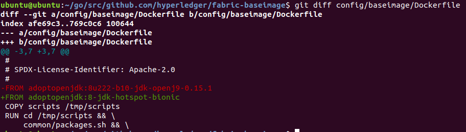

### 修改script
```sh
vim scripts/common/setup.sh
```
```
apt-get -y install golang-1.6
調整為
apt-get -y install golang
```
```
export GOROOT_BOOTSTRAP="/usr/lib/go-1.6"
調整為
export GOROOT_BOOTSTRAP="/usr/lib/go"
```
```
apt-get -y remove golang-1.6
調整為
apt-get -y remove golang
```
```
ARCH=`uname -m | sed 's|i686|x86|' | sed 's|x86_64|x64|'`
調整為
ARCH=`uname -m | sed 's|i686|x86|' | sed 's|x86_64|x64|' | sed 's|aarch64|arm64|'`
```
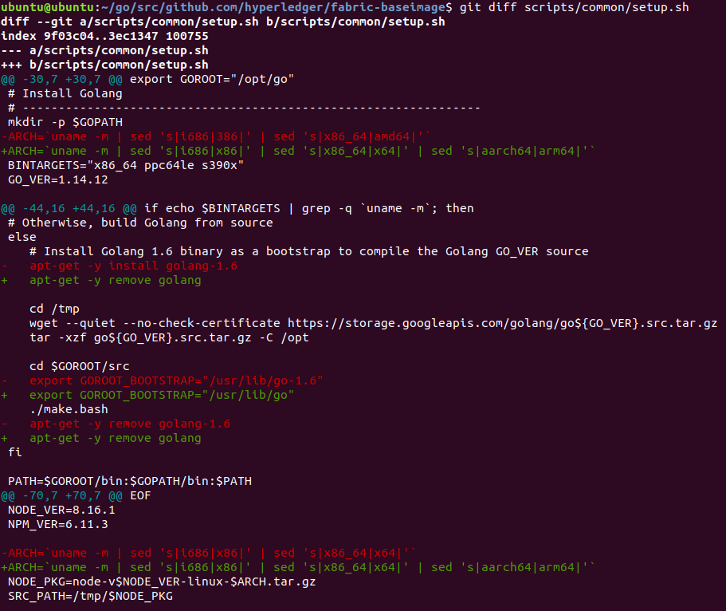

### 編譯docker鏡像
```sh
cd ~/go/src/github.com/hyperledger/fabric-baseimage/
make
```
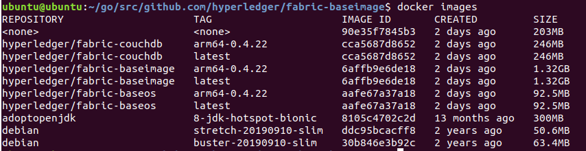

---

## 修改fabric
### 進入fabric專案
```sh
cd ~/go/src/github.com/hyperledger/fabric
```

### 修改ccenv Dockerfile
```sh
vim images/ccenv/Dockerfile
```
```
在RUN apk add指令中
增加
binutils-gold \
```
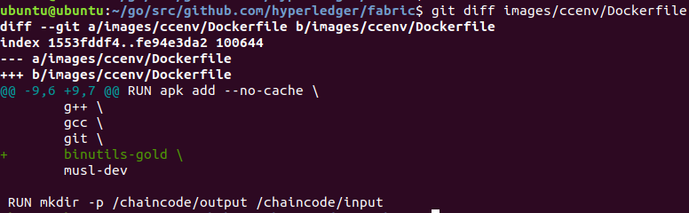

### 修改orderer Dockerfile
```sh
vim images/orderer/Dockerfile
```
```
在RUN apk add指令中
增加
binutils-gold \
```
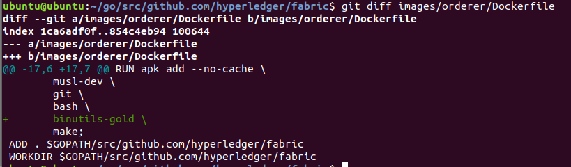

### 修改peer Dockerfile
```sh
vim images/peer/Dockerfile
```
```
刪除 FROM alpine:${ALPINE_VER} as peer-base
刪除 RUN apk add --no-cache tzdata
調整為 FROM ubuntu as peer-base
```
```
刪除 FROM golang:${GO_VER}-alpine${ALPINE_VER} as golang
調整為 FROM golang:${GO_VER}-buster as golang

刪除 RUN apk add --no-cache \
調整為 RUN apt install -y \

增加 binutils \

刪除 musl-dev

make \ 調整為 make
```
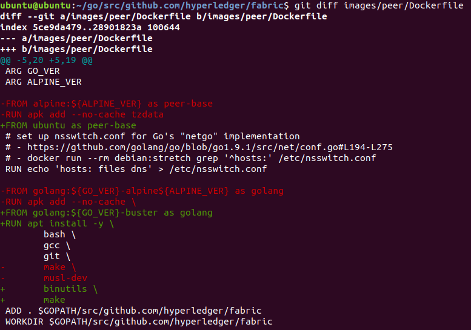

### 修改tools Dockerfile
```sh
vim images/tools/Dockerfile
```
```
刪除 FROM golang:${GO_VER}-alpine${ALPINE_VER} as golang
調整為 FROM golang:${GO_VER}-buster as golang

刪除 RUN apk add --no-cache \
調整為 RUN apt install -y \

刪除 musl-dev

make \ 調整為 make;

刪除 FROM golang:${GO_VER}-alpine
調整為 FROM golang:${GO_VER}-buster

刪除 RUN apk add --no-cache \
調整為 RUN apt install -y \

刪除 jq \
刪除 tzdata;

git \ 調整為 git;
```
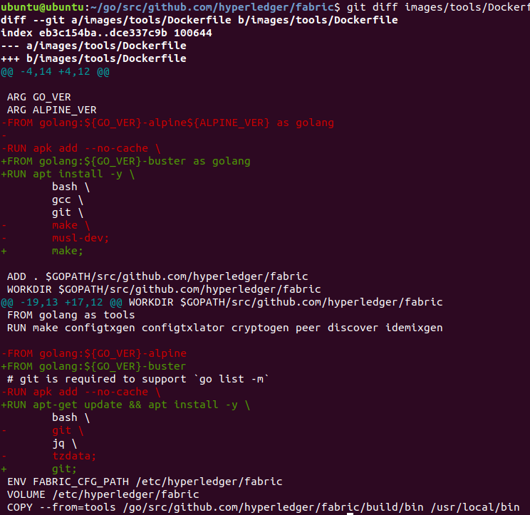

### 修改core.yaml
```sh
vim sampleconfig/core.yaml
```
```
註解bootstrap: 127.0.0.1:7051
Memory: 2147483648 改成 Memory: 16777216
```
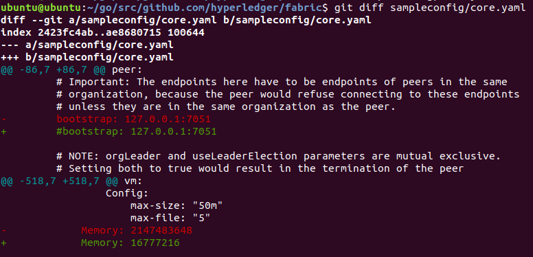

### 編譯docker鏡像及binary檔
```sh
cd ~/go/src/github.com/hyperledger/fabric
make
```
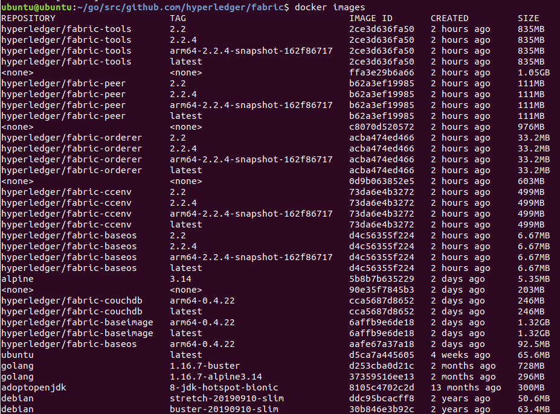

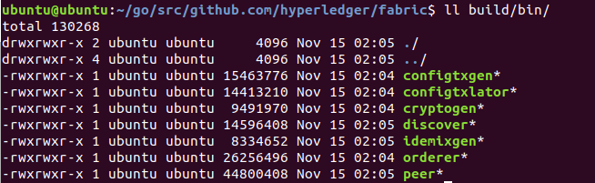

### 移動binary檔
```sh
cd ~/go/src/github.com/hyperledger/fabric/build/bin
sudo cp * /usr/local/bin/
ll /usr/local/bin/
```

---

## 修改fabric-ca
### 進入ca專案
```sh
cd ~/go/src/github.com/hyperledger/fabric-ca
```
### 修改Dockerfile
```sh
vim images/fabric-ca/Dockerfile
```
```sh
刪除 FROM golang:${GO_VER}-alpine as builder
調整為 FROM golang:${GO_VER}-buster as builder

刪除 RUN apk add --no-cache \
調整為 RUN apt install -y \

刪除 musl-dev

git \ 調整為 git;

刪除 FROM alpine:${ALPINE_VER}
刪除 RUN apk add --no-cache \
刪除 tzdata;
調整為 FROM ubuntu:19.10
```
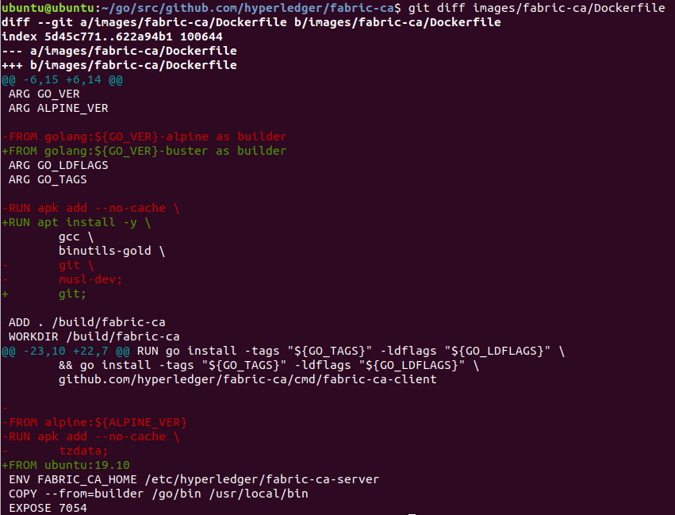

### 編譯docker鏡像
```sh
cd ~/go/src/github.com/hyperledger/fabric-ca/
make
```
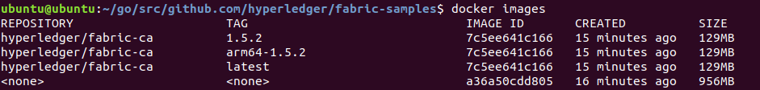

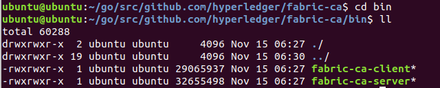

### 移動binary檔
```sh
cd ~/go/src/github.com/hyperledger/fabric-ca/bin
sudo cp * /usr/local/bin/
ll /usr/local/bin/
```

---


## 測試fabric-samples
### 複製檔案
```sh
# 複製binary
cd ~/go/src/github.com/hyperledger/fabric/build/
sudo cp -r bin/ ~/go/src/github.com/hyperledger/fabric-samples/
ll ~/go/src/github.com/hyperledger/fabric-samples/bin/

# 複製config
cd ~/go/src/github.com/hyperledger/fabric
sudo cp -r sampleconfig/ ~/go/src/github.com/hyperledger/fabric-samples/

# 修改config資料夾名稱
cd ~/go/src/github.com/hyperledger/fabric-samples/
mv sampleconfig/ config
ll ~/go/src/github.com/hyperledger/fabric-samples/config
```

### 調整network

```sh
vim ~/go/src/github.com/hyperledger/fabric-samples/test-network/network.sh
```
```
在docker容器啟動後，增加sleep 15秒中，等待容器啟動完成
```

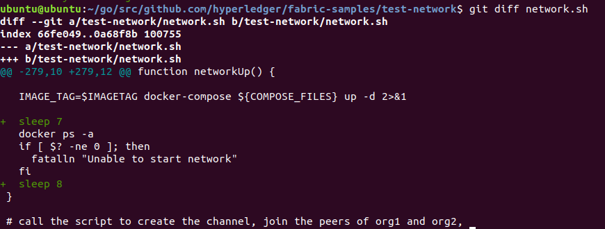

### 測試
* 測試到建立通道，應可確認編譯成功
```sh
cd ~/go/src/github.com/hyperledger/fabric-samples/test-network/

./network.sh down

./network.sh up createChannel
```

