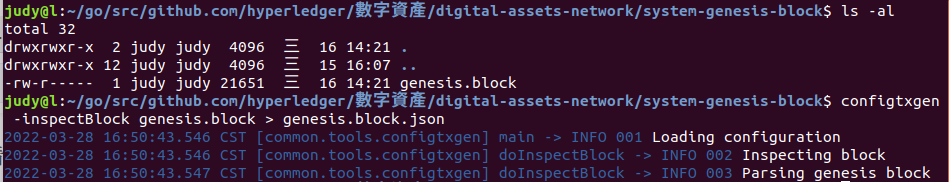
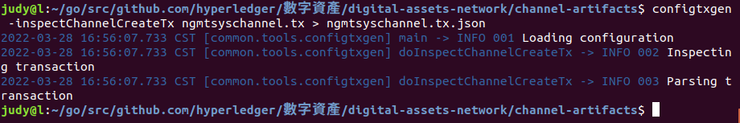

# 指令
### 查看創世區塊、交易的指令
* 將創世區塊導入json
```sh
configtxgen -inspectBlock genesis.block > genesis.block.json
```


* 將交易塊導入json
```sh
configtxgen -inspectChannelCreateTx ngmtsyschannel.tx > ngmtsyschannel.tx.json
```


* 獲取orderer0憑證字串（base64）
```sh
cat genesis.block.json | jq '.data.data[0] .payload.data.config.channel_group.groups.Orderer.values.ConsensusType.value.metadata.consenters[0] .client_tls_cert'
```
* 將base64轉成憑證
```sh
cat genesis.block.json | jq '.data.data[0] .payload.data.config.channel_group.groups.Orderer.values.ConsensusType.value.metadata.consenters[0] .client_tls_cert' | xargs echo | base64 -d > orderer0.pem
```