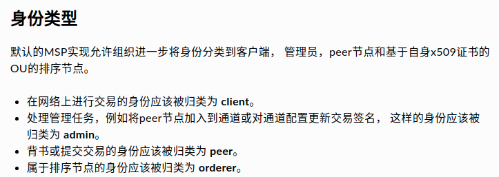

# msp及背書策略
### 其他連結
- [术语表](https://hyperledger-fabric.readthedocs.io/zh_CN/release-2.2/glossary.html)
### MSPs
- [成员服务提供者 MSP](https://hyperledger-fabric.readthedocs.io/zh_CN/release-2.2/msp.html)
- [成员服务提供者 MSP](https://hyperledgercn.github.io/hyperledgerDocs/msp_zh/)：本文提供MSP的设置细节，致力于打造MSP的最佳实践。
- Hyperledger Fabric網路中的角色：orderers, client application, administrators
  - 
  - 這些角色都有一個身份標識，也叫做Identity，藉由X.509憑證來表示
  - 這些Identity決定了該角色的對區塊鏈網絡上資源的權限，比如是否有權限訪問區塊鏈上的某種信息
  - MSP是Fabric中的一個組件，它定義了管理有效identity的規則
  - Fabric中默認的MSP實現是使用X.509證書作為identity
  - 所以identity == 藉由MSP實現 == fabric中各個角色的X.509憑證
- 
### 背書策略
- 策略中指定要幾個member，指令中就要帶有幾個msp憑證
- 有chaincode-level和collection-level背書策略
- [背书策略](https://hyperledger-fabric.readthedocs.io/zh_CN/release-2.2/endorsement-policies.html)
- 
### 相關問題
- [Adding custom Node OUs with Hyperledger Fabric](https://stackoverflow.com/questions/60256416/adding-custom-node-ous-with-hyperledger-fabric)
- [How do the different MSP roles (member, admin, peer, client) affect Hyperledger Fabric Endorsement policies?](https://stackoverflow.com/questions/52207260/how-do-the-different-msp-roles-member-admin-peer-client-affect-hyperledger)
- [Hyperledger Fabric - Role of member vs peer](https://stackoverflow.com/questions/67405125/hyperledger-fabric-role-of-member-vs-peer)
- 

